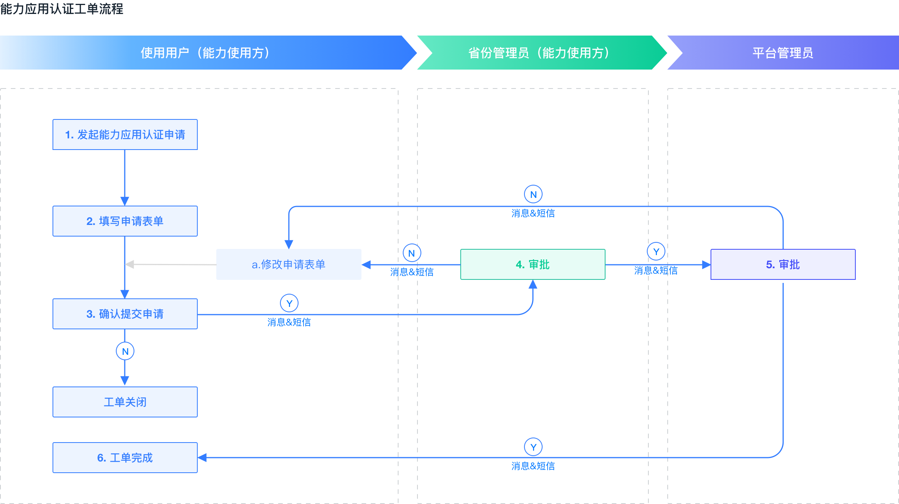
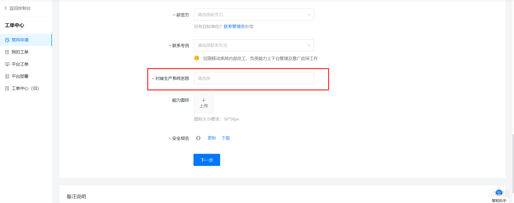
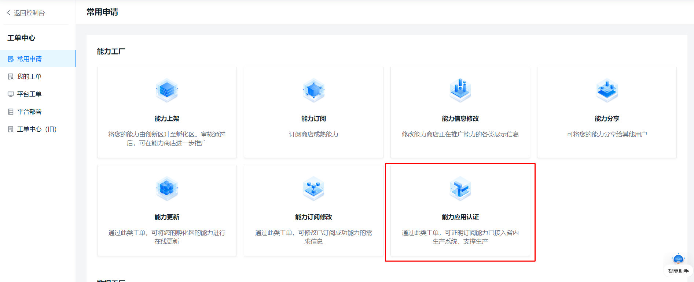
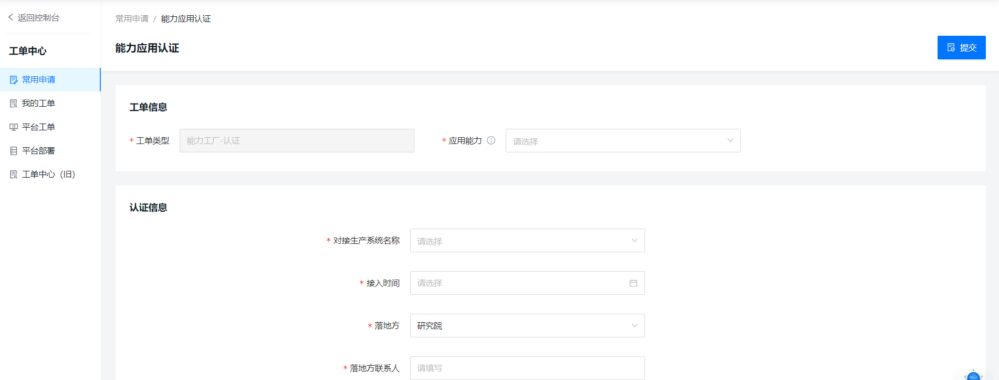
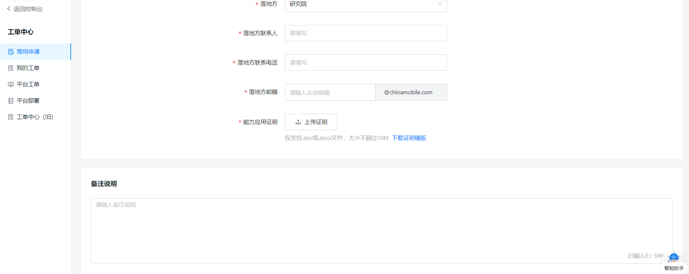
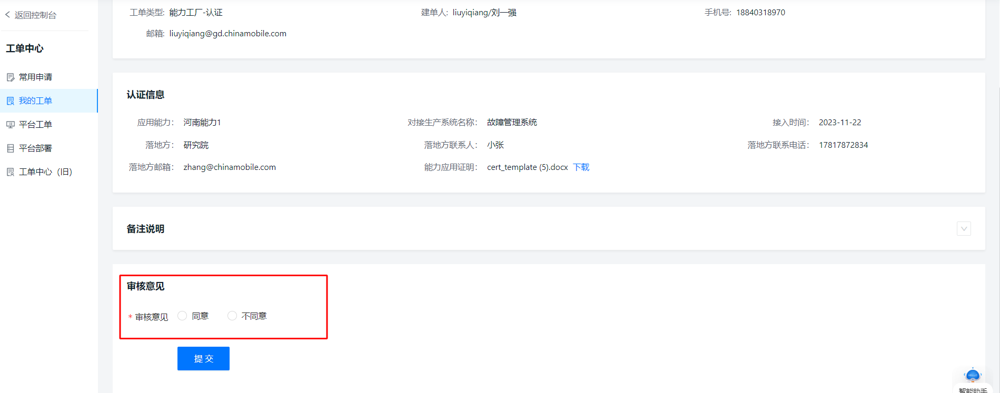

## 流程概述

 
对于本省自研的能力，能力上架过程已考核了省内生产调用、产生成效情况，等同于完成了本省能力应用认证。

 
  
对于引入的第三方孵化区能力，若已支撑省内生产调用、产生成效，可通过工单中心的【能力应用认证】工单进行的能力应用认证，认证完成的能力/省份将计入能力复用情况统计。

  
   
能力应用认证需具备的基本条件为该能力近一月每周调用量不小于25次且近一月累计调用量不小于150次。

## 操作指引

对于本省自研的能力，能力应用认证通过能力上架考核。在上架过程中，填写对接生产系统名称即可。其中对接生产系统名称可以多选。

对于引入的第三方孵化区能力的能力应用认证

### Step1: 发起能力应用工单

入口为工单中心-常用工单-能力应用认证。

### Step2: 填写能力应用认证工单并提交

1.选择待应用认证的能力，该能力在发起工单的前30日需满足基本调用要求；

2.填写能力引入的相关信息，其中对接生产系统名称为集团统一命名，需按省侧真实系统与集团18个集中系统名称对应；

3.提交表单；

4.补充说明：同一“应用能力+生产系统”在本省内不可重复发起工单。

### Step3: 工单审核

由省公司管理员和平台管理员分别对工单进行审核。

### Step3: 工单完成，能力应用认证成功

管理员审核通过后，工单完成，能力应用认证成功。