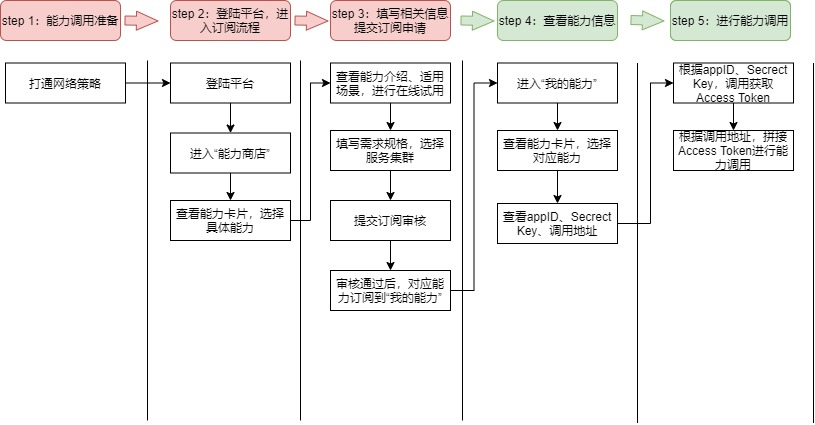
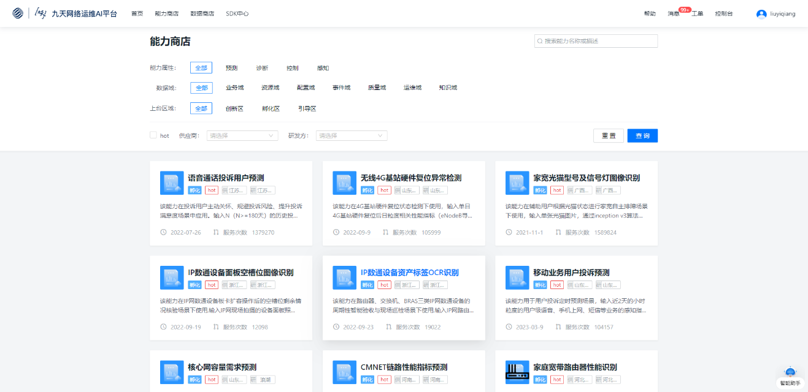
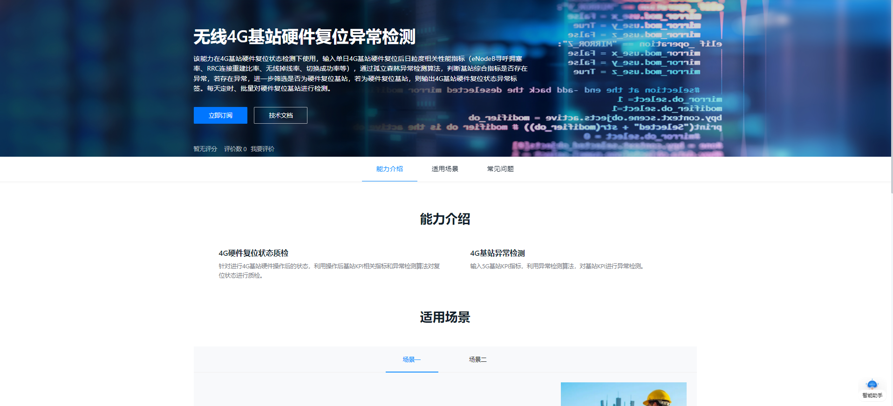
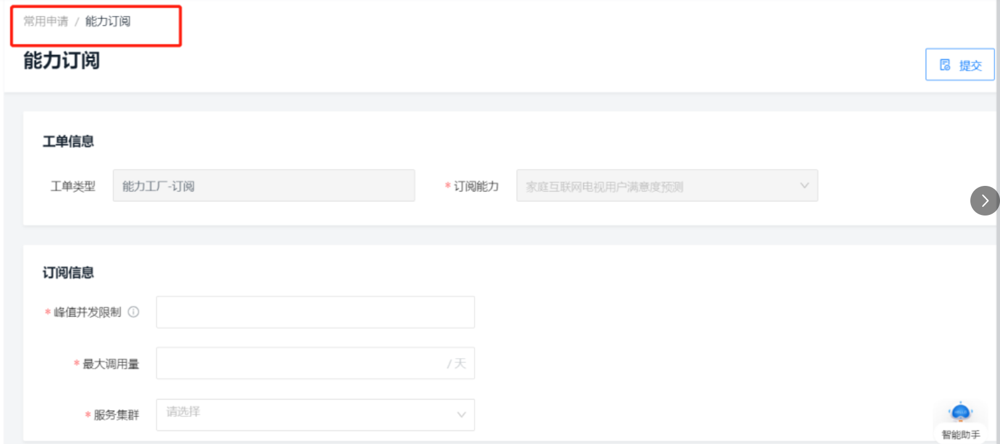
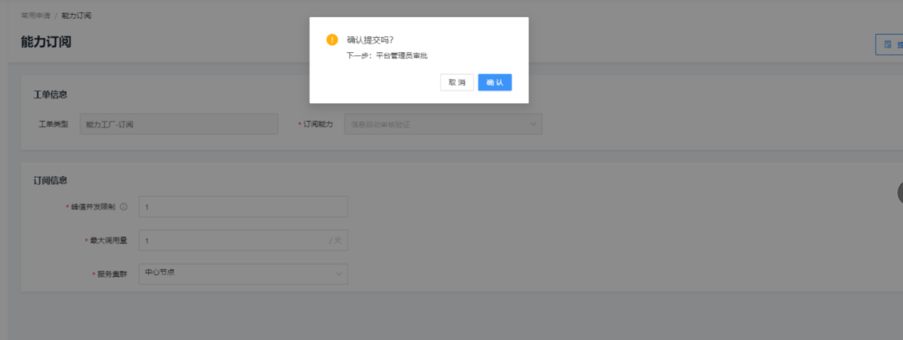
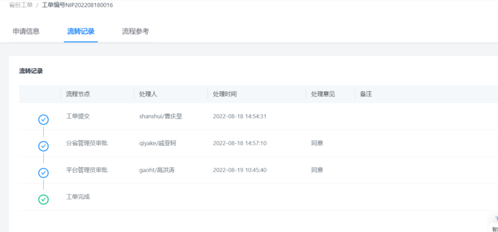
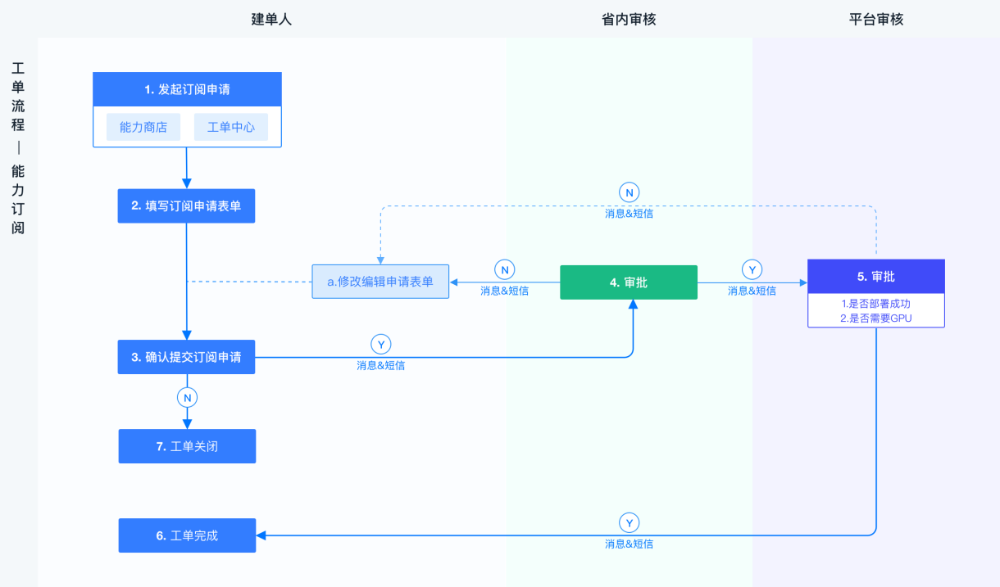
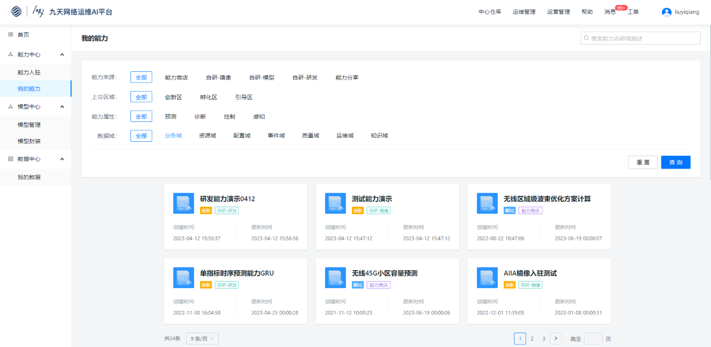
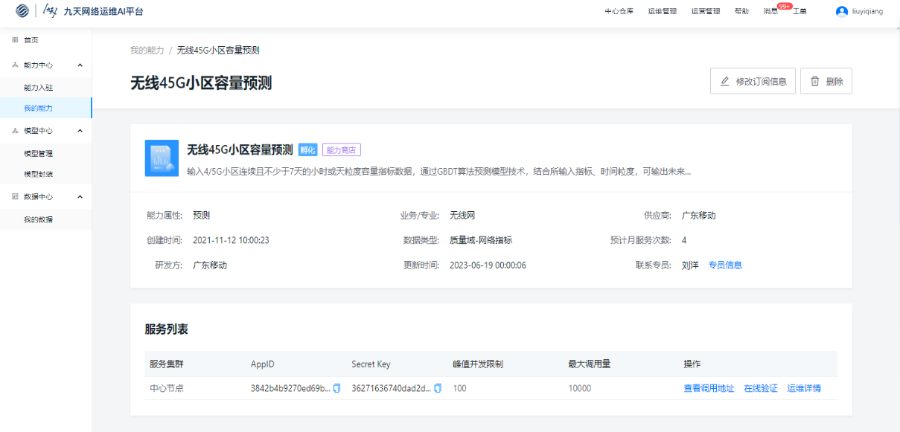

平台提供了丰富的成熟能力供用户调用，调用流程如下：

### Step1：能力调用准备

以调用部署在中心节点的能力为例，若要调用部署在边缘节点的能力，则策略地址需要改成对应边缘节点的网关地址，各边缘节点的网关地址详见【网关地址<a href="https://doc.cmri.cn/kdocs/l/cjd5DUEm0D65" target="_blank" rel="noreferrer"> https://doc.cmri.cn/kdocs/l/cjd5DUEm0D65</a>】

打通与能力调用机器的网络策略（如在平台访问章节已申请开通网络策略，则忽略此步骤）具体打通步骤如下：

* 模板（sheet2）填写用户侧所属网络、IP地址、服务端口、以及B、C、D、E列的基本信息（模板中标红的部分），发送给浙江公司（邮箱：tianshan@zj.chinamobile.com）开通策略，约2-3天，策略开通后可收到回复邮件。

* 用户端省公司开通O域承载网出口策略。

* 两端策略开通后需要用户侧进行网络测试，若有问题请邮件回复浙江公司或电话联系（王海杰：19548735714）。

参考【策略开通模板<a href="https://doc.cmri.cn/kdocs/l/cdZjxTC91Ltj" target="_blank" rel="noreferrer"> https://doc.cmri.cn/kdocs/l/cdZjxTC91Ltj</a>】

### Step2: 登录平台，进入订阅流程

1.输入<a href="http://10.76.153.18:30201/nip" target="_blank">http://10.76.153.18:30201/nip</a>进入平台首页，点击【能力商店】，查看能力卡片，选择具体能力

### Step3: 填写相关信息，提交订阅申请

1.查看能力介绍、适用场景，进行在线试用

2.新建能力订阅工单，填写需求规格，选择服务集群

3.提交订阅审核

4.审核通过后，对应能力订阅到“我的能力”

### Step4: 查看能力信息

1.进入“我的能力”，查看能力卡片（此处显示包括订阅能力与通过能力上台流程上台的自研能力），选择对应能力

2.查看appId、Secrect Key、调用地址

### Step5: 进行能力调用

调用逻辑流程如下：

1. 调用获取Access Token

2. 缓存Access Token

3. 使用缓存Access Token调用接口

4. 如果调用成功，结束；否则转第5步

5. 判断调用失败原因，如果是Access Token过期，转第1步；否则结束。

&ensp;各步骤详情如下：

&emsp;1. 根据appId、Secrect Key，调用获取Access Token，接口文档如下：

<table><tr><th>接口方式</th><td colspan ="3">GET</td></tr><tr><th>请求参数</th><td colspan ="3"><a href="http://10.76.153.18:30201/api/v1/ability_sub/external/getToken?appId=999&secret=999" target="_blank">http://10.76.153.18:30201/api/v1/ability_sub/external/getToken?appId=999&secret=999</a></td></tr> <tr><td colspan ="4">请求参数：</td></tr> <tr><th>参数名：</th><th>说明：</th><th>取值：</th><th>备注：</th></tr> <tr><th>appId</th><th>应用id</th><th>string</th><th></th></tr><tr><th>secret</th><th>密钥</th> <th>string</th><th></th></tr><tr><td colspan ="4">输出参数：</td></tr> <tr><th>参数名：</th><th>说明：</th><th>取值：</th><th>备注：</th></tr> <tr><th>appId</th> <th>应用id</th><th>string</th> <th></th></tr><tr><th>token</th> <th>Token</th><th>string</th><th></th></tr><tr><td colspan ="4">{ "state": "OK", "requestId": null, "body": { "appId": "124", "token": "999" }, "resultCode": "200", "resultMessage": "成功", "errorParams": null}</td></tr></table>

各节点获取accessToken地址示例如下： 

*  中心节点（集团）调用获取accessToken地址：

    <a href="http://10.76.153.11:30100/api/v1/ability_sub/external/getToken?appId=bf0cc838383bc98b7476c0ce647e607e&secret=eb0264ef87398f77b9b511ba698eb427" target="_blank">http://10.76.153.11:30100/api/v1/ability_sub/external/getToken?appId=bf0cc838383bc98b7476c0ce647e607e&secret=eb0264ef87398f77b9b511ba698eb427</a>

* 浙江边缘节点调用获取accessToken地址：

    <a href="http://10.76.153.11:30100/api/v1/ability_sub/external/getToken?appId=bf0cc838383bc98b7476c0ce647e607e&secret=eb0264ef87398f77b9b511ba698eb427" target="_blank">http://10.76.153.11:30100/api/v1/ability_sub/external/getToken?appId=bf0cc838383bc98b7476c0ce647e607e&secret=eb0264ef87398f77b9b511ba698eb427</a>

* 河南边缘节点调用获取accessToken地址：

	<a href="http://10.217.58.146:8082/api/v1/ability_sub/external/getToken?appId=bf0cc838383bc98b7476c0ce647e607e&secret=eb0264ef87398f77b9b511ba698eb427" target="_blank">http://10.217.58.146:8082/api/v1/ability_sub/external/getToken?appId=bf0cc838383bc98b7476c0ce647e607e&secret=eb0264ef87398f77b9b511ba698eb427</a>

* 天津边缘节点调用获取accessToken地址：

	<a href="http://10.228.247.136:8082/api/v1/ability_sub/external/getToken?appId=bf0cc838383bc98b7476c0ce647e607e&secret=eb0264ef87398f77b9b511ba698eb427" target="_blank">http://10.228.247.136:8082/api/v1/ability_sub/external/getToken?appId=bf0cc838383bc98b7476c0ce647e607e&secret=eb0264ef87398f77b9b511ba698eb427</a>

* 山东边缘节点调用获取accessToken地址:

	<a href="http://10.214.144.2:30282/api/v1/ability_sub/external/getToken?appId=bf0cc838383bc98b7476c0ce647e607e&secret=eb0264ef87398f77b9b511ba698eb427" target="_blank">http://10.214.144.2:30282/api/v1/ability_sub/external/getToken?appId=bf0cc838383bc98b7476c0ce647e607e&secret=eb0264ef87398f77b9b511ba698eb427</a>

* 共享平台边缘节点调用获取accessToken地址：

	<a href="http://10.228.214.151:8082/api/v1/ability_sub/external/getToken?appId=bf0cc838383bc98b7476c0ce647e607e&secret=eb0264ef87398f77b9b511ba698eb427" target="_blank">http://10.228.214.151:8082/api/v1/ability_sub/external/getToken?appId=bf0cc838383bc98b7476c0ce647e607e&secret=eb0264ef87398f77b9b511ba698eb427</a>

    

* 江苏边缘节点调用获取accessToken地址：

	<a href="http://10.39.195.17:8082/api/v1/ability_sub/external/getToken?appId=bf0cc838383bc98b7476c0ce647e607e&secret=eb0264ef87398f77b9b511ba698eb427" target="_blank">http://10.39.195.17:8082/api/v1/ability_sub/external/getToken?appId=bf0cc838383bc98b7476c0ce647e607e&secret=eb0264ef87398f77b9b511ba698eb427</a>

    

* 安徽边缘节点调用获取accessToken地址：

	<a href="http://82.221.6.230:8082/api/v1/ability_sub/external/getToken?appId=bf0cc838383bc98b7476c0ce647e607e&secret=eb0264ef87398f77b9b511ba698eb427" target="_blank">http://82.221.6.230:8082/api/v1/ability_sub/external/getToken?appId=bf0cc838383bc98b7476c0ce647e607e&secret=eb0264ef87398f77b9b511ba698eb427</a>

    

* 湖南边缘节点调用获取accessToken地址：

	<a href="http://10.159.49.84:8082/api/v1/ability_sub/external/getToken?appId=bf0cc838383bc98b7476c0ce647e607e&secret=eb0264ef87398f77b9b511ba698eb427" target="_blank">http://10.159.49.84:8082/api/v1/ability_sub/external/getToken?appId=bf0cc838383bc98b7476c0ce647e607e&secret=eb0264ef87398f77b9b511ba698eb427</a>

   

* 北京边缘节点调用获取accessToken地址：

	<a href="http://172.26.8.68:8082/api/v1/ability_sub/external/getToken?appId=bf0cc838383bc98b7476c0ce647e607e&secret=eb0264ef87398f77b9b511ba698eb427" target="_blank">http://172.26.8.68:8082/api/v1/ability_sub/external/getToken?appId=bf0cc838383bc98b7476c0ce647e607e&secret=eb0264ef87398f77b9b511ba698eb427</a>

   

* 广东边缘节点调用获取accessToken地址：

	<a href="http://192.167.39.30:8082/api/v1/ability_sub/external/getToken?appId=bf0cc838383bc98b7476c0ce647e607e&secret=eb0264ef87398f77b9b511ba698eb427" target="_blank">http://192.167.39.30:8082/api/v1/ability_sub/external/getToken?appId=bf0cc838383bc98b7476c0ce647e607e&secret=eb0264ef87398f77b9b511ba698eb427</a>

   

* 陕西边缘节点调用获取accessToken地址：

	<a href="http://10.206.193.66:8082/api/v1/ability_sub/external/getToken?appId=bf0cc838383bc98b7476c0ce647e607e&secret=eb0264ef87398f77b9b511ba698eb427" target="_blank">http://10.206.193.66:8082/api/v1/ability_sub/external/getToken?appId=bf0cc838383bc98b7476c0ce647e607e&secret=eb0264ef87398f77b9b511ba698eb427</a>

    

&emsp;2. 缓存token

&emsp;3. 根据调用地址（Step3的第4点），拼接缓存Access Token进行api调用，能力调用地址：url?accessToken=xxxx

示例：

如能力调用地址为：<a href="http://172.31.178.139:8080/app-52q9vwpnyxro2k/tttt" target="_blank">http://172.31.178.139:8080/app-52q9vwpnyxro2k/tttt</a>

调用地址：<a href="http://172.31.178.139:8080/app-52q9vwpnyxro2k/tttt?accessToken=xxxx" target="_blank">http://172.31.178.139:8080/app-52q9vwpnyxro2k/tttt?accessToken=xxxx</a>

&emsp;4. Token有效期为1h，到期后需重新获取token。判断token有效性及重新获取token的参考代码如下：

参考【 token_demo <a href="https://doc.cmri.cn/kdocs/l/chUKQiMOQdeG" target="_blank" rel="noreferrer">https://doc.cmri.cn/kdocs/l/chUKQiMOQdeG</a>】

