## 创新区能力更新

### Step1: 镜像更新

1.通过我的能力能力详情页面【镜像更新】发起能力更新。

2.镜像更新流程，包括镜像配置、测试部署、上传安全报告。


镜像更新入口：我的能力详情【镜像更新】如下图示

 

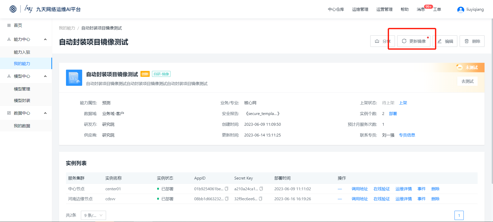


镜像更新分为3步：镜像配置、测试部署、上传安全报告。


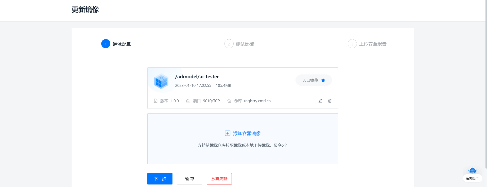

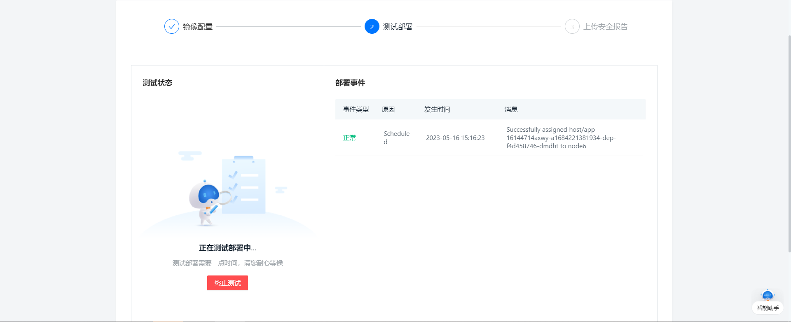

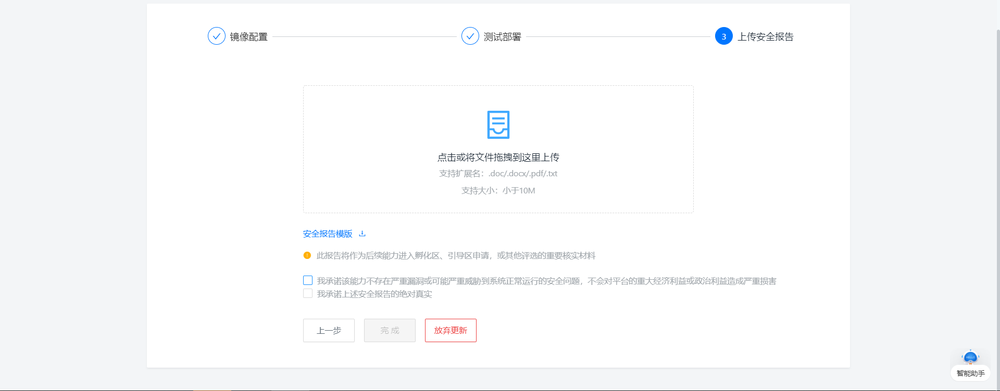


### Step2: 实例更新

1.通过我的能力能力详情页面【部署】发起实例更新。

2.实例更新，通过页面配置部署参数。


实例更新入口，实例列表【更新】





实例更新操作，按页面对参数进行配置，点击完成即可。


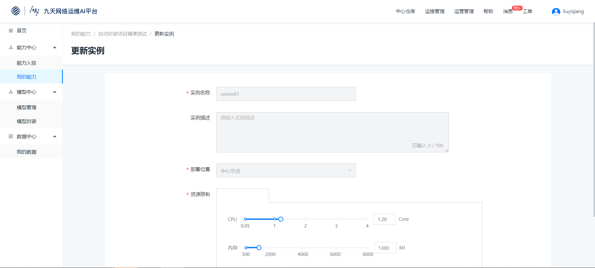


更新成功后，操作变更为“—”，如下图示


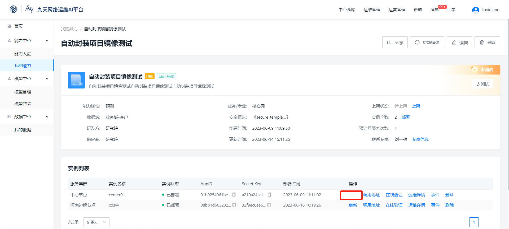

## 孵化区能力更新

### Step1: 发起能力更新工单

工单中心-常用工单-能力更新，发起孵化区能力更新工单。
 

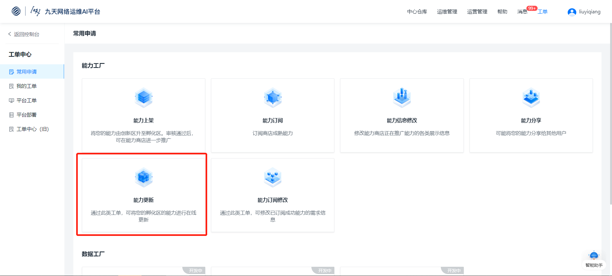


### Step2: 填写能力更新工单并提交

选择待更新的孵化区能力，并按表单分别填写更新原因、是否变更接口调用、变更影响说明，表单填写完毕后提交。

1.更新原因：主要描述为什么要更新该能力；

2.是否变更接口调用：指该能力更新后，调用该能力时接口是否发生变更。如果是，需提供开放API，即新的接口；如果否，则调用接口不变；

3.更新影响说明：主要描述本次能力更新后，对能力使用方的影响说明。

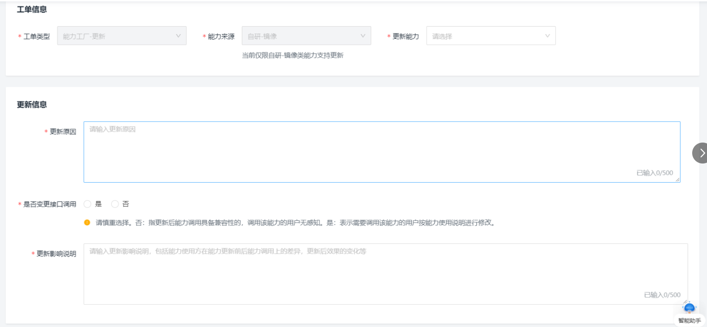

### Step3: 申请阶段工单审核

提交能力更新工单后，将依次由能力提供方省份管理员审核、能力使用方省份管理员审核（接口更新影响使用方使用时才需该角色审批）、平台管理员审核。

1.各角色审批不通过，工单将回流至建单人，对表单修改后再次提交；

2.各角色均审核通过后，进入能力更新阶段。

3.可通过流转记录查看该工单审批进度。

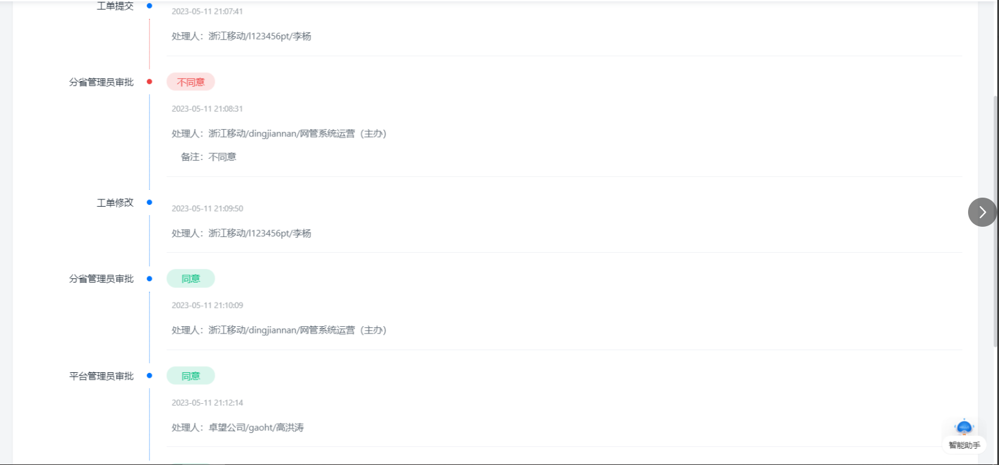

### Step4: 更新阶段能力更新

能力审批通过后，进入能力更新阶段。能力更新阶段分为2步能力提供方更新、平台更新。

### Step4-1: 能力提供方能力更新

提供方能力更新过程需要2步：镜像更新、实例更新。


1.镜像更新：

* 能力更新申请审批通过后，会进入镜像更新节点，提示您有能力待更新。

* 点击更新进入镜像更新流程，包括镜像配置、测试部署、上传安全报告。

* 镜像更新完成后，页面点击下一步，进入实例更新环节。


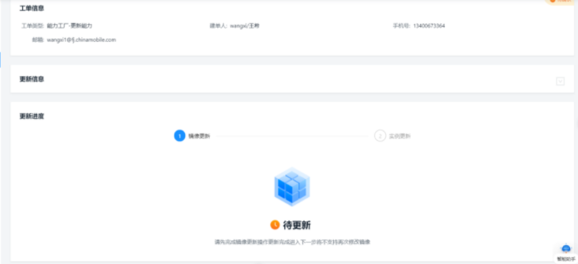

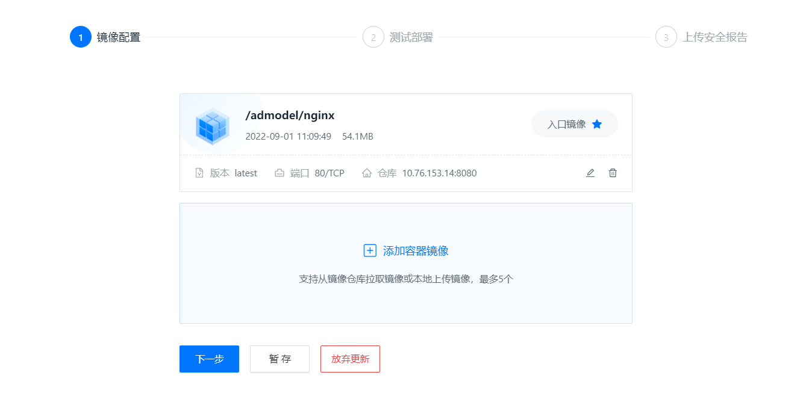

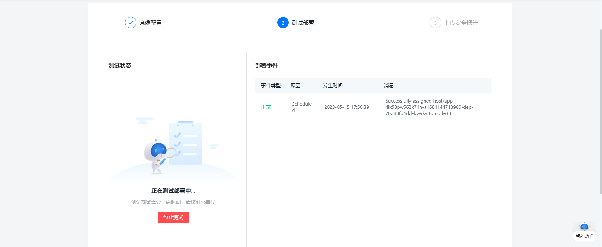

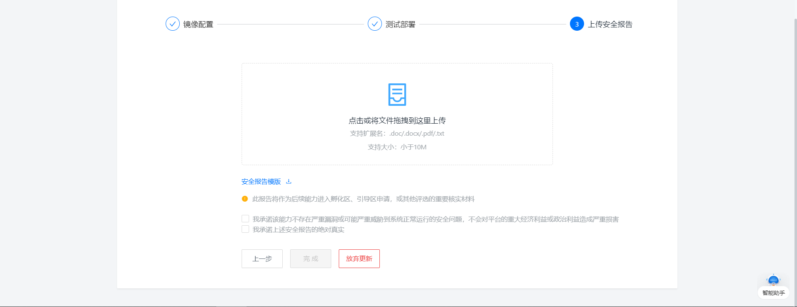

2.实例更新

* 实例更新需要对待更新能力重新部署，包括中心节点以及您所在省的边缘节点（如果在该节点部署过）。

* 实例部署需要通过页面配置部署环境，然后进行在线部署。

* 当您完成能力提供方节点实例更新后，申请平台侧处理。

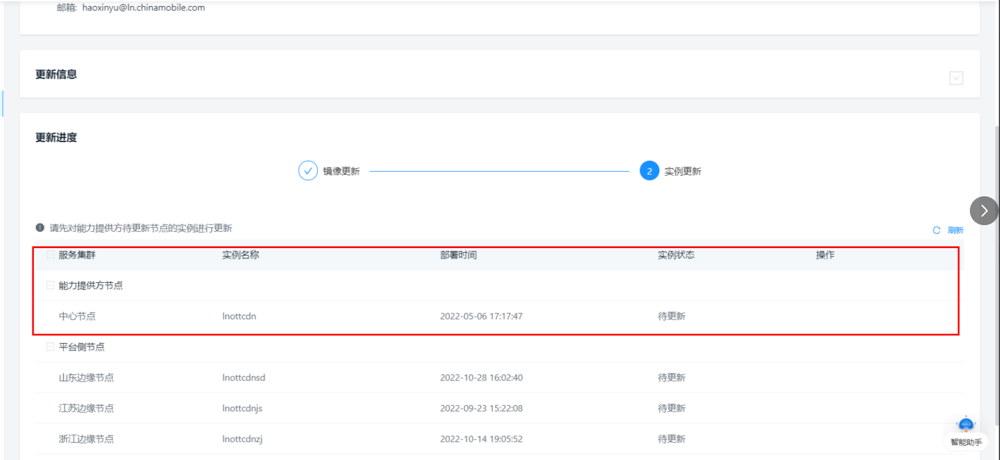

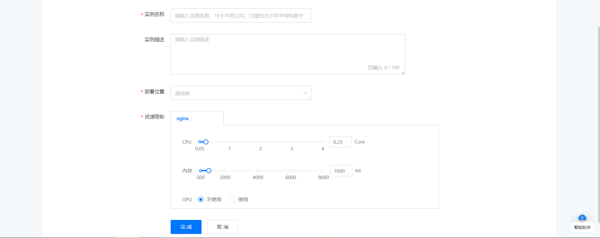

### Step5: 平台运维能力更新

平台运维能力更新主要是平台运维侧操作，对能力提供方节点之外的节点进行实例更新。

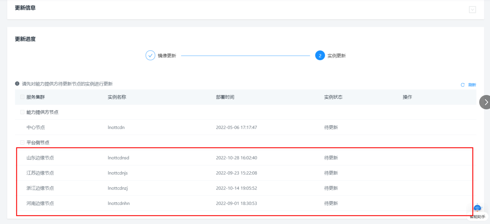

### Step6: 工单完成，能力更新成功

平台运维更新完成后，工单完成，本次能力更新成功。

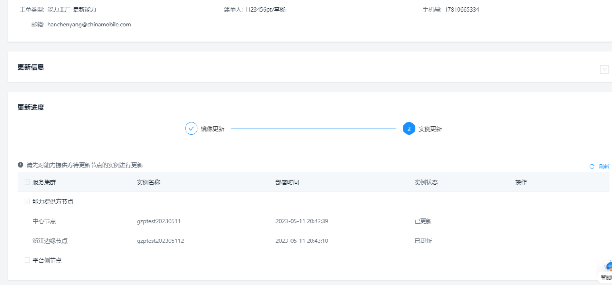