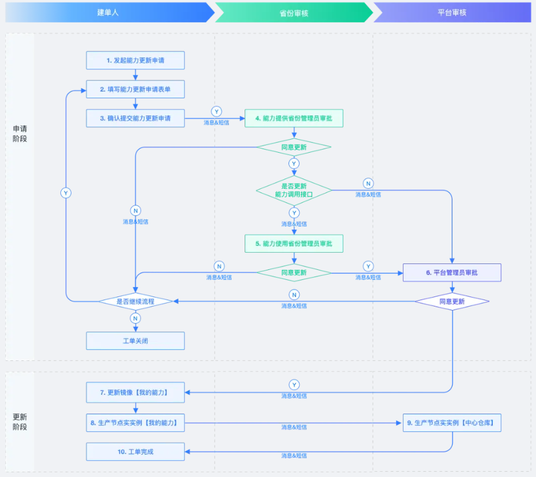

能力更新指将能力的镜像和实例进行版本更新，从而向能力使用方提供最新版的能力。不同区能力更新流程不同：

1.创新区：能力定位为供自己使用的私有能力，能力更新由能力提供方自行操作；

2.孵化区：能力定位为供全网用户使用的高质量能力，能力更新由能力提供方、平台、能力使用方协同决定。

3.孵化区能力更新流程。包括2个阶段：

* 阶段一：申请阶段

  由能力提供方发起能力更新工单，经由能力提供方省份管理员、能力使用方省份管理员（可选）、平台管理员对本次更新授权同意后，方可对该能力进行更新操作。

* 阶段二：更新阶段

  由能力提供方分别更新镜像、中心节点及自己所在省边缘节点的能力相关实例，再提交至平台管理员。由平台管理员对余下边缘节点实例更新完成后，能力更新完成。

参考<a href="img/镜像仓库策略开通模板.xlsx"download="镜像仓库策略开通模板.xlsx" target="_blank">镜像仓库策略开通模板.xlsx</a> 

