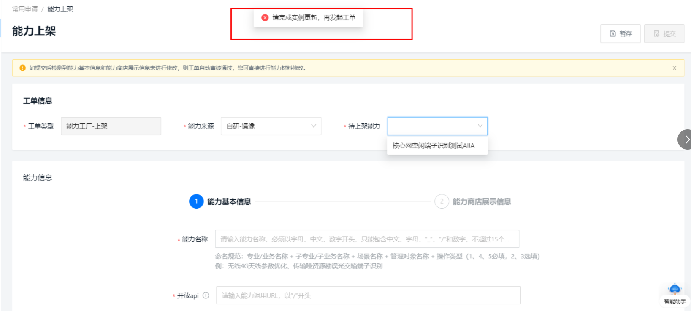
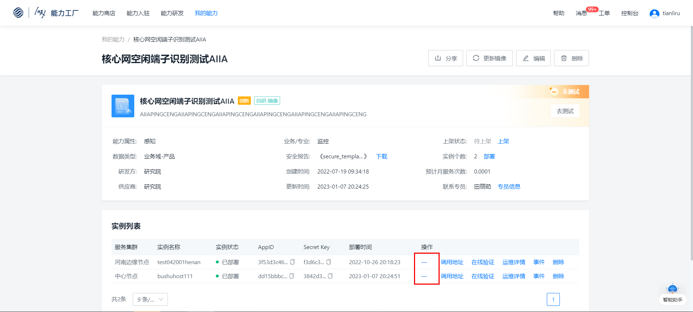
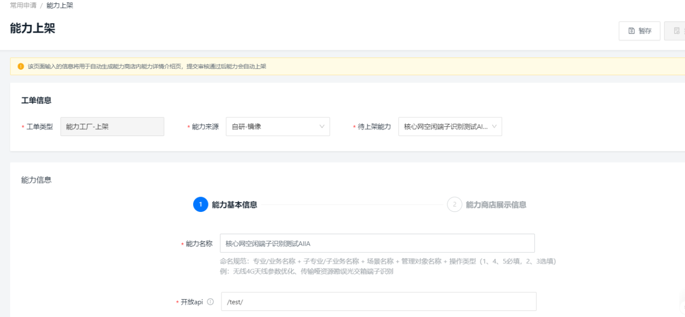

### 1.发哪些能力可以申请上架？

自研的创新区能力可以由能力入驻者账号申请上架。

### 2.一个能力可以同时发起多个上架工单？

一个能力在仅可以发起一个上架工单。创建能力上架工单时系统会做校验，如发现您有在途的上架工单，将不允许您再次发起。

### 3.发起能力上架工单时，系统提示“请完成实例更新，再发起工单”时什么原因？该如何操作？

创新区能力，如果您操作过镜像更新，但未进行实例更新，系统检测到您的镜像版本与实例版本不一致，在发起上架工单时就会系统提示“请完成实例更新，再发起工单”。如下图示。

孵化区能力定位：向全网用户提供稳定可靠的能力调用，需要您的镜像版本和实例版本一致。这种情况下，您可以在我的能力详情页，完成实例更新后，再发起能力上架工单申请。如下图示，点击更新后，对页面指引完成实例更新。“—”表示已更新完成。

实例更新完成后，再回到工单中心发起能力上架工单，则可以选择目标能力，编辑能力上架申请表单。如下图示

