

能力上架入口分为2种，入口一：选择能力卡片进入我的能力对应能力详情后，可点击【上架】进行能力的上架操作。点击上架后将发起对应能力上架工单，根据页面指导反馈相关信息。入口二：进入工单中心，常用工单选择发起能力上架工单，选择待上架能力，根据页面指导反馈相关信息。完成工单流转（即通过审核）就可以上架到能力商店（孵化区）。



### Step1: 发起能力上架工单

1.发起入口一：【我的能力】【能力详情】。进入我的能力待上架能力的详情页，点击“上架”。

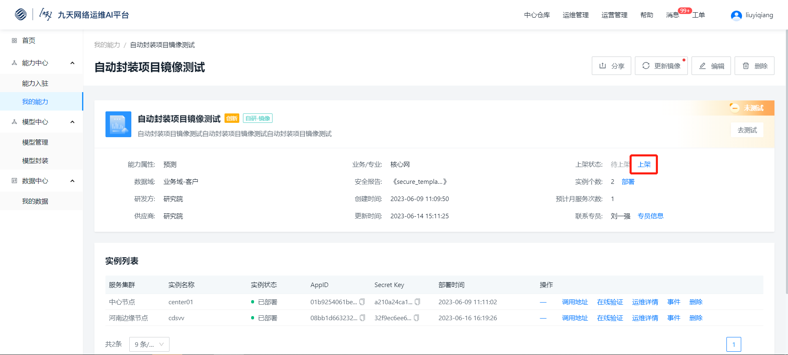


点击“上架”后，跳转至工单中心-常用申请-能力上架，按表单要求填写即可。


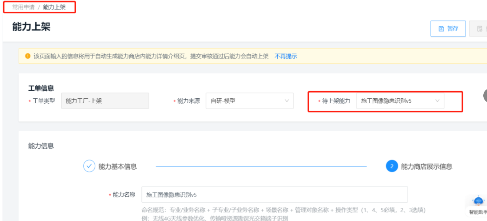

2.发起入口二：工单中心，【工单中心】【常用工单】“能力上架”。进入工单中心，常用申请，发起能力上架工单。

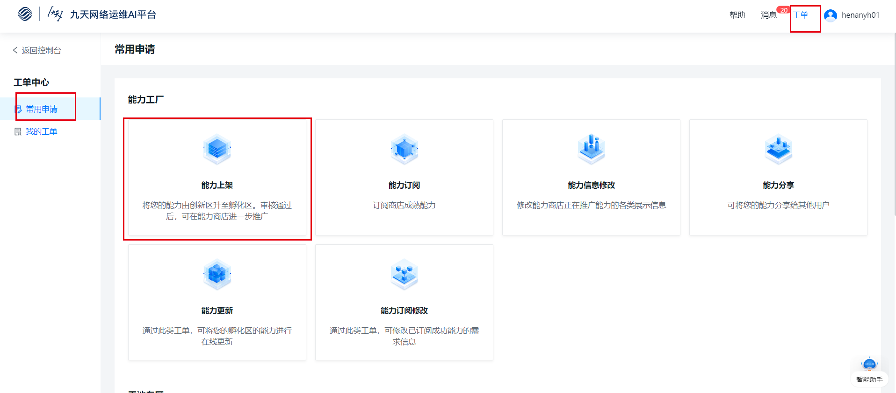


### Step2: 填写能力上架工单并提交

1.选择待上架能力

2.修改并确定能力的基本描述信息。

3.填写能力商店能力展示信息。

4.提交表单


选择待上架能力，您可能遇到系统提示“请完成实例更新，再发起工单”，原因与解决方案参见5.3常见问题-第3条问题。


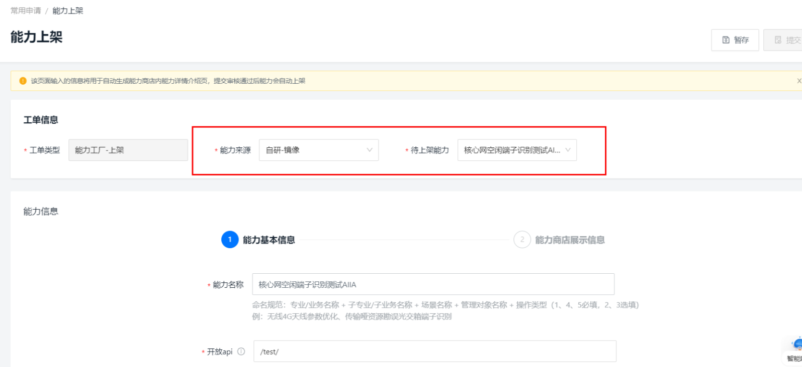



能力基本信息主要为能力入驻时填写的内容，您可以在此基础上修改与编辑。图示如下


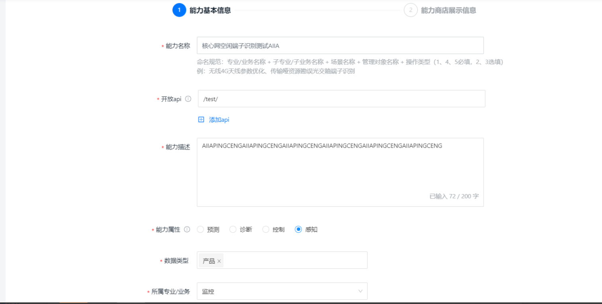

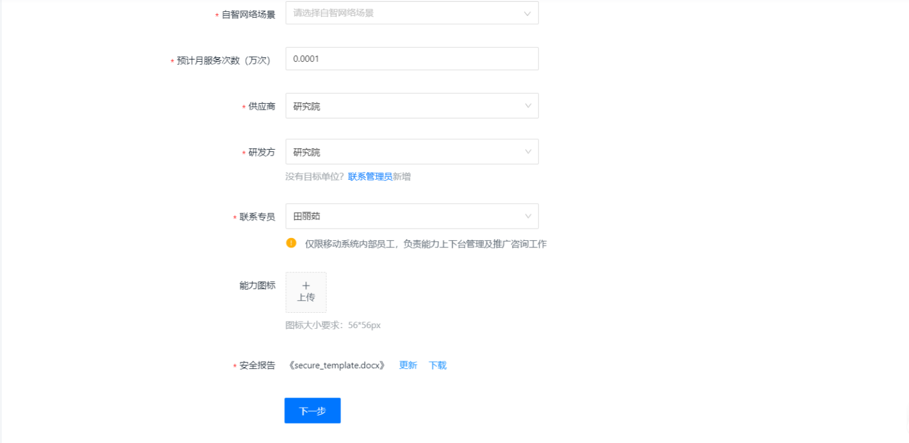


能力商店展示信息主要用以能力商店的能力宣传，分为必填项和选填项，如下图示：


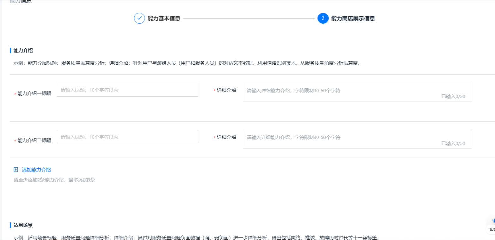

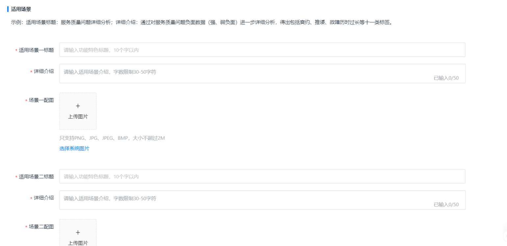

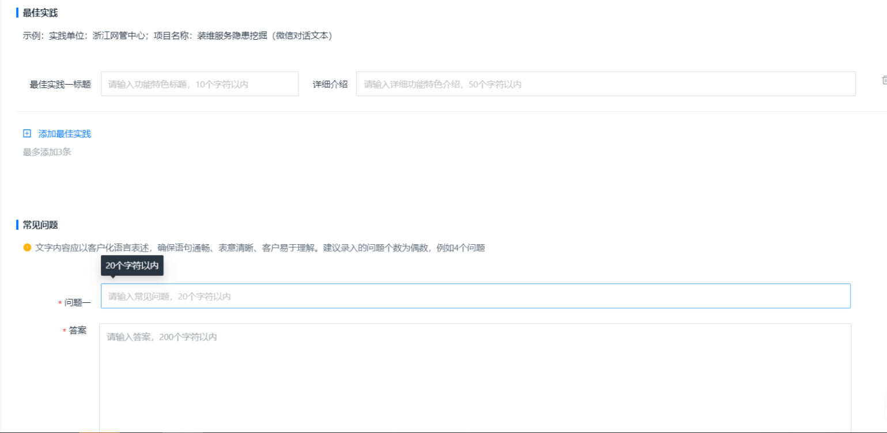


填写完毕后，提交工单即可。


### Step3:能力基本信息审核

1.能力上架申请提交后，将分别有省份管理员、平台管理员、专家对您填写的表单进行审核；

2.审核不通过，工单将流转到您的待办工单，需要参照step2对工单修改后再次提交；

3.审核通过后，工单将流转到您的待办工单，您需要按模板提供技术文档及孵化区申请材料，参照step4。

4.整个过程可通过流转记录查看并更新工单流转情况。

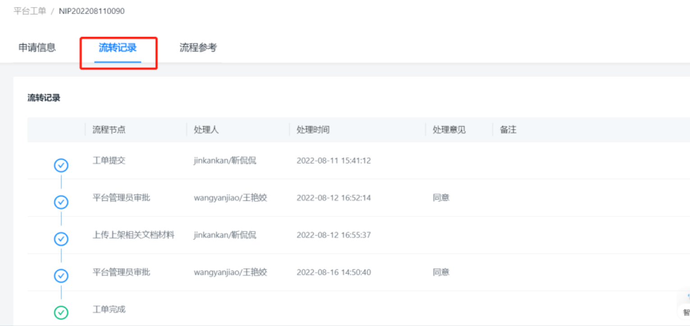


### Step4:材料信息提供并提交

1.按页面指引上传技术文档与孵化区申请材料。

2.如果您在此之前在【我的能力】完成了【在线测试】，技术文档系统将自动生成并提供在工单中，您也可以选择本地上传。

3.材料信息上传成功后，提交工单，进入step5。

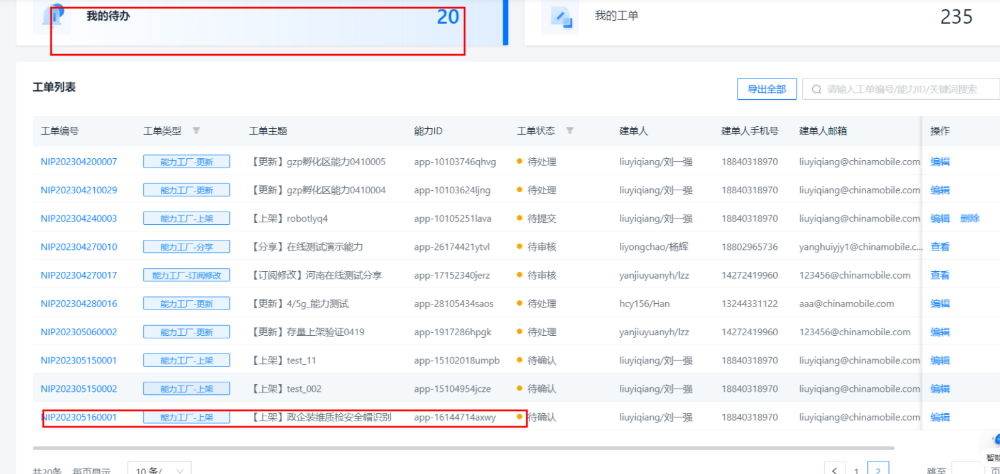

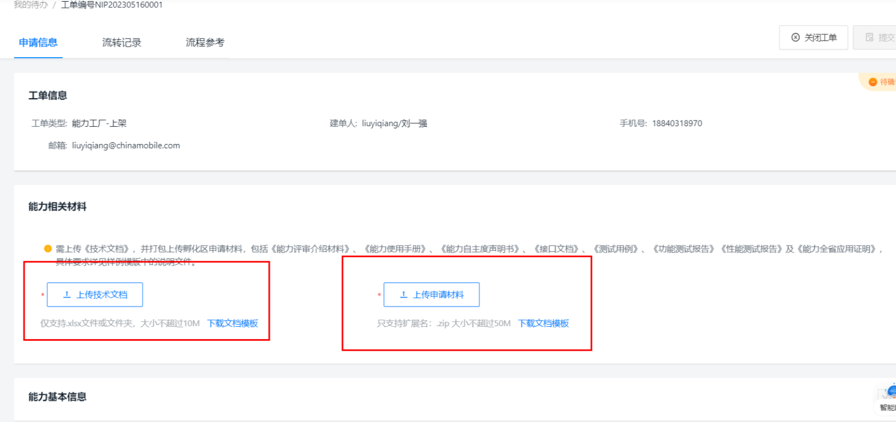

### Step5:能力材料信息审核

1.材料信息提交后，将分别有省份管理员、平台管理员进行审核；

2.审核不通过，工单将流转到您的待办工单，对工单修改后再次提交；

3.审核通过后，工单完成，能力上架成功


### Step6:工单完成，能力上架成功

工单完成，能力上架成功，可通过能力商店对能力全网推广使用。

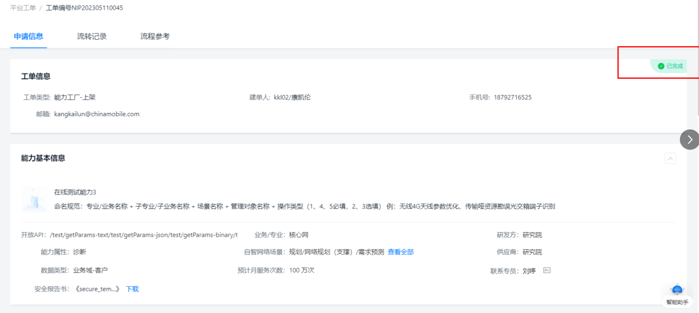